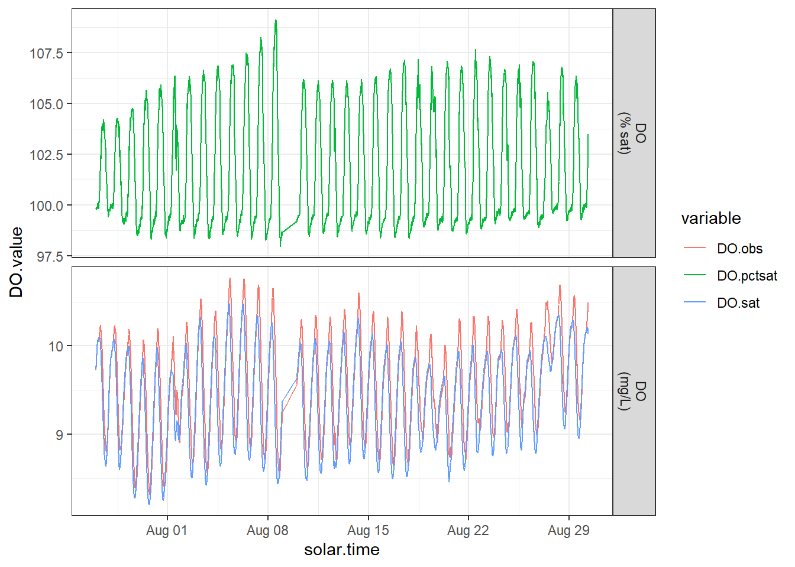
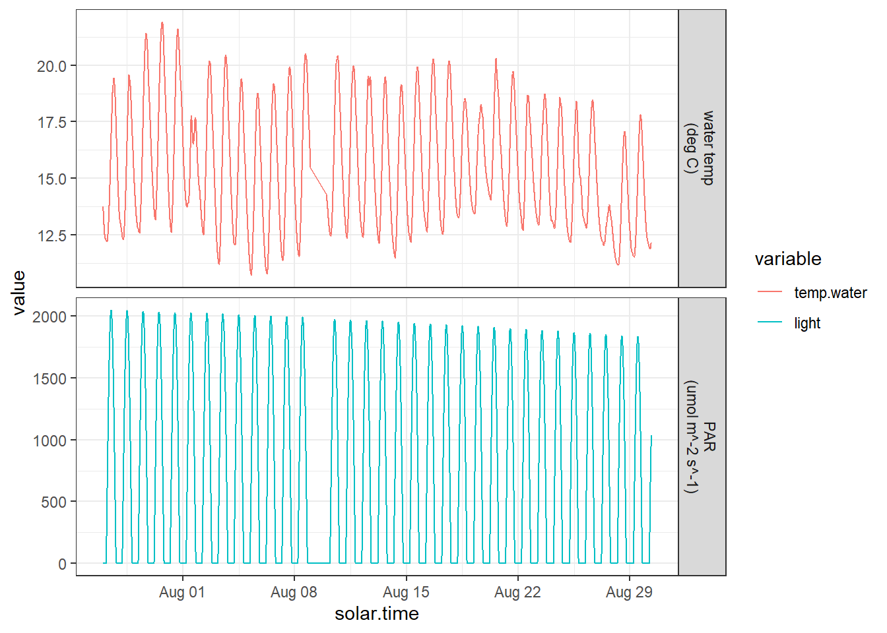
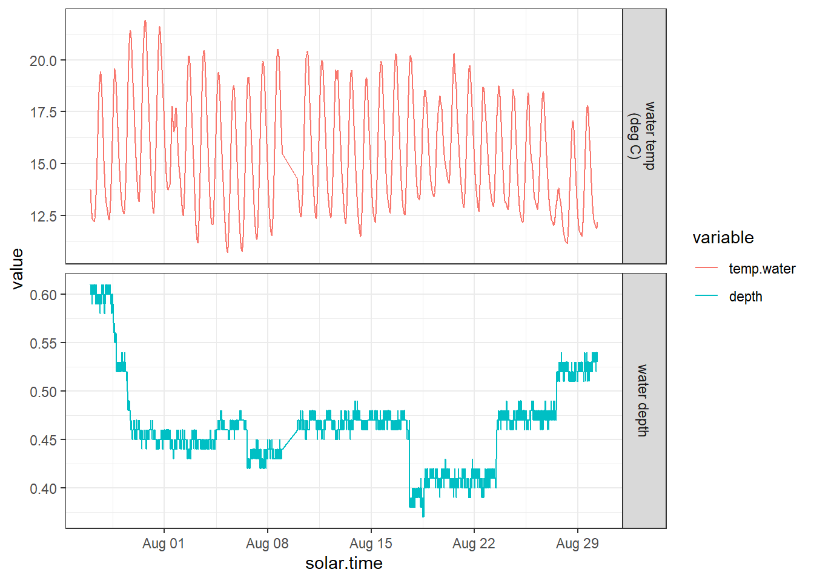
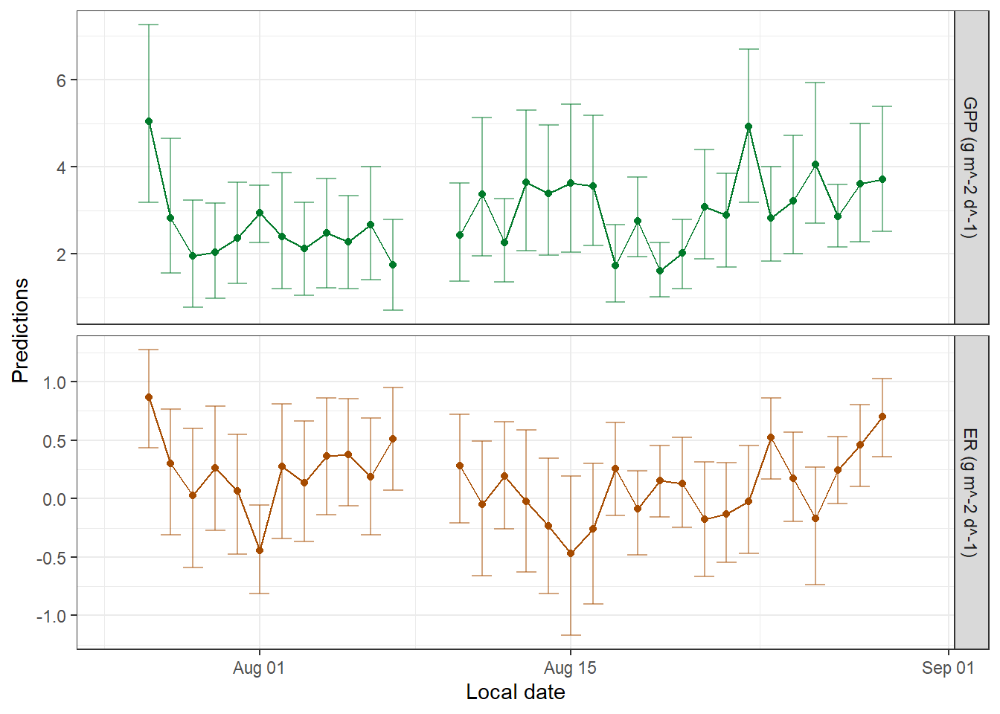
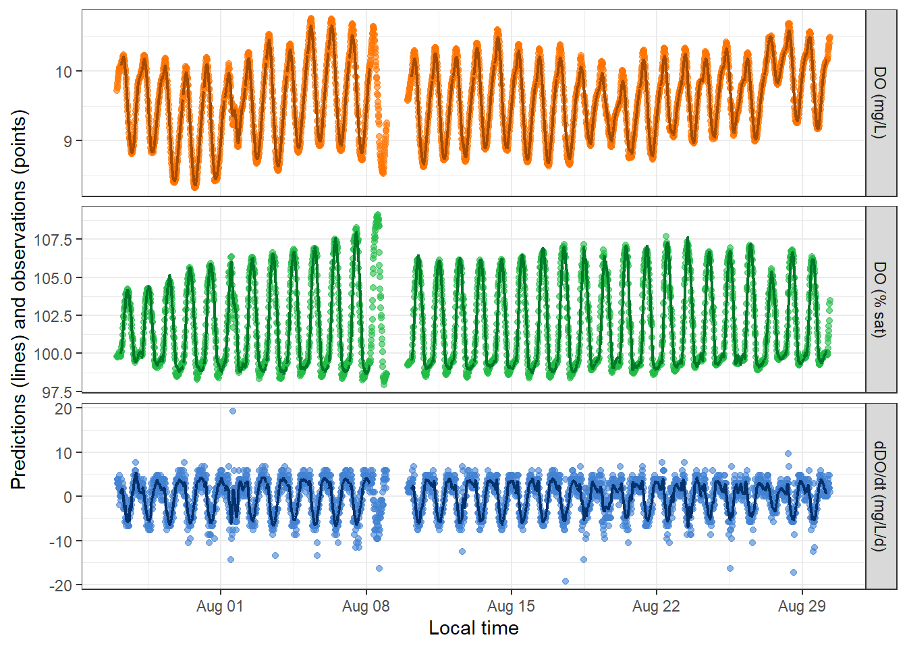
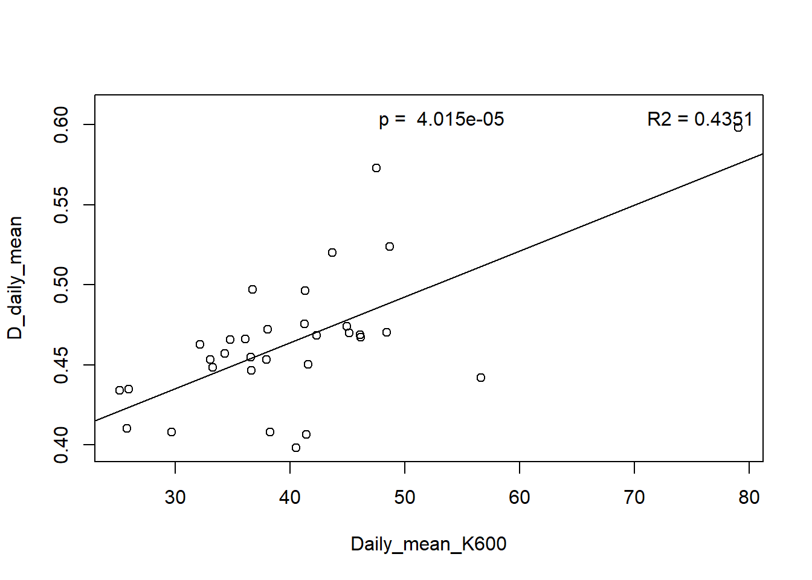
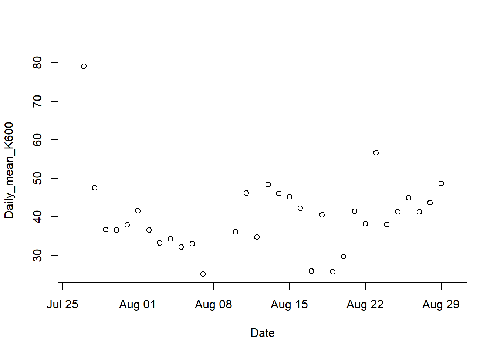

##Matt Kaufman, matthew.kaufman@pnnl.gov, Pacific Northwest National Laboratory
##This code is the template file that controls most of the stream metabolizer runs for the 2022 spatial study dataset. It takes in time-series dissolved oxygen, depth, and barometric pressure data, as well as single-point location data and an estimate of k600. From all of that, it estimates GPP, ER, and k600 on a daily basis over the course of the deployment. In general, if there is a lot of correlation between k600 and ER results, it is acceptable to use the deployment-period-average values, but the day-to-day variation should not be trusted.


## 1. Install packages and loading libraries
If this is your first time running this code or streamMetabolizer, make sure to install the appropriate packages below. uncomment them in the chunk before Knitting.


```r
# install.packages(remotes); library(remotes)
# remotes::install_github('appling/unitted', force = TRUE)
#library('chron')
# remotes::install_github("DOI-USGS/streamMetabolizer", force = TRUE, build_vignettes = TRUE)
# install.packages("rstan", dependencies = FALSE)
# install.packages('devtools')

# If you have trouble installing rstan, try the installation codes below: 

#devtools::install_github("stan-dev/rstan", ref = "develop", subdir = "rstan/rstan", force = TRUE)
#install.packages("rstan", type = "source")

# Run the line below if you have trouble installing devtools
#devtools::install_github("stan-dev/rstan", ref = "develop", subdir = "rstan/rstan")
```

### Loading libraries


## 2. Setting up the data
Set working directory and read in the data and change units to match the needs of stream metabolizer.
Note: Make sure to always double check that your date time column is in the date time format and not as character


```r
#-------------------------------------
#PARENT_ID='' #this is where you would specify a site if you were not running this as a loop
#-------------------------------------

print("PARENT_ID: ")
```

```
## [1] "PARENT_ID: "
```

```r
PARENT_ID = 'SSS041'

print("SITE_ID: ")
```

```
## [1] "SITE_ID: "
```

```r
SITE_ID = 'S49R'
```


```r
#bp<-bpcalc(29.9, 489/3.28)# elevation at satus (alt in meters) #---------------------------------------------------------------------

data.path = "Inputs/"

dat = read.csv(paste0(data.path,'Sensor_Files/v2_',PARENT_ID,"_Temp_DO_Press_Depth.csv"),header=T,skip=8)
 
 K600estimates=read.csv(paste0(data.path,'v2_SSS_K600.csv'),header=T,skip=3)
 K600estimate<-K600estimates[K600estimates$Site_ID==SITE_ID,2]
 
print("K600 estimate: ")
```

```
## [1] "K600 estimate: "
```

```r
K600estimate
```

```
## [1] 92.85
```

```r
 output.path="Outputs/"

 #---------------------------------------------------------------------------------------------
  file.name = paste('v2_SSS_SM_',PARENT_ID,'_',SITE_ID,'_final',sep='')
  #dat = na.omit(dat)
  #dat=dat[450:33311-300,] #-------------------------------------------------------------------------------------------------------------
 # Change date time format  

#DOWNSAMPLE
samplingmins=15
dat = dat[seq(1, nrow(dat), samplingmins), ]


#colnames(dat)[10]="Unix.Timestamp" 
#dat$timeUTC<-as_datetime(dat$Unix.Timestamp)

#data is always collected in pacific-standard-time, so conversion to UTC is +8 hours
dat$timeUTC<-as.POSIXct(dat$DateTime)+hours(8)
dat$timeUTC<-force_tz(dat$timeUTC,tzone='UTC')
dat$solar.time<-convert_UTC_to_solartime(dat$timeUTC, longitude= dat$Longitude[1], time.type="mean solar") #----------------------------------


dat$light<- calc_light(dat$solar.time, latitude=dat$Latitude[1], longitude=dat$Longitude[1], max.PAR =2300, attach.units = F) #------------------

# cal_DO_stat requieres barometric pressure in millibars, or a unitted object of barometric pressure.
dat$DO.sat=calc_DO_sat(dat$Temperature,dat$Pressure, model = 'garcia-benson') 


# Selecting the data types that are needed for stream metabolizer and changing header names. Running the model with K600_pooling = normal does not require discharge input

dat = dat %>% dplyr::select("solar.time" = solar.time,"DO.obs" = Dissolved_Oxygen,"DO.sat" = DO.sat,"temp.water" = Temperature,"light" = light,"depth" = Depth)
```

Check the number of cores you have in your computer. Based on the number that it prints, set the number of cores you want to dedicate to the metabolism run. It is recommended to set 2-4 cores less than you have in your computer to minimize the chances of R crashing. It is also recommended to select a pair number for your run. 


```r
parallel::detectCores()
```

```
## [1] 12
```

## 3. Inspect Data


## 4. Configure the model
We will select a Bayesian model. Then we will configure the specs of the model depending on the needs of our run.    
You can play around with the number of iterations (e.g., 100 burnin iterations , also called warm up) and 50 saved steps. You can adjust the number of iterations based on the convergence of the convergence of the model.  
For example, you may start with 1000 and 500 and then up the numbers to 2000 and 1000 if the model results don't seem to converge. 

If you have already adjusted the number of steps multiple times and your model fits are still not good (e.g., negative GPP values) you might have to consider changing other specs in the model. Some examples of variables that you may change are: GPP_daily_lower = 0.01,ER_daily_upper = -0.01. However, you should consult the Help for more information.

Use the command plot_distribs if you want to observe the distribution of the specs if they were changed. 


```r
# Set the model

bayes_name = mm_name(type='bayes',
                     pool_K600='normal', 
                     err_obs_iid=TRUE, 
                     err_proc_iid=TRUE)
bayes_name
```

```
## [1] "b_Kn_oipi_tr_plrckm.stan"
```

```r
 # Options for pool K600 are binned, linear, none and normal. If normal is specified, discharge doesn't need to be provided

# Changing the specs

bayes_specs = specs(bayes_name, K600_daily_meanlog_meanlog=log(K600estimate), K600_daily_meanlog_sdlog=0.7, K600_daily_sdlog_sigma=0.05, burnin_steps=1000, 
                  saved_steps=1000)
```

## 5. Fit the model and save the results
Fitting the model might take hours or days depending on the dataset.
Some times R crashes while you are running the model so you want to make sure to save your results in each run. Create an output folder inside of the path where you are storing the data, the output path will update automatically here once you change your data path in step 2. 

Some key parameters to look at in the mm output are:  
- $daily (includes metabolism estimates) 
- $overall (includes error information) 
- $KQ_overall (included the relationship between K600-Q)


```r
mm = metab(bayes_specs, data=dat)# 
#load("~/GitHub/gitlab/SSS_metabolism/initial_SM_testing/test_15min.RData")

#Extracting the data from the model output the outputs are in a S4
#class of data and you'll need to operators to extract the daily
#time series of estimates
#get_fit(mm) %>%
  #lapply(names)

# Saving key data
#output.path = paste0(data.path,"/Output/")
preds = mm@fit$daily
preds_output<-preds
#str(preds)
write.csv(preds_output,paste0(output.path,'v2_',PARENT_ID,"_",SITE_ID,"_SM_final_daily_prediction_results.csv"),row.names = FALSE) 

instant = mm@fit$inst
instant_output<-instant
#str(instant)
write.csv(instant_output,paste0(output.path,'v2_',PARENT_ID,"_",SITE_ID,"_SM_final_instant_fit_results.csv"),row.names = FALSE)

Overall = mm@fit$overall
Overall_output<-Overall
#str(Overall)
write.csv(Overall_output,paste0(output.path,'v2_',PARENT_ID,"_",SITE_ID,"_SM_final_overall_fit_results.csv"),row.names = FALSE)

full = predict_DO(mm)
full_output<-full
#str(KQ)
write.csv(full_output,paste0(output.path,'v2_',PARENT_ID,"_",SITE_ID,"_SM_final_full_prediction_results.csv"),row.names = FALSE)


#get_data(mm)# Shows a table with all the data + DO modeled
#get_data_daily(mm) #daily fitting data. It shows values for Q for now
#get_params(mm)
```

## 6. Inspect GPP, ER and K600

### Daily predictions of modeled GPP and ER

The goal is for the predictions (lines) and observations (points) to be very similar. 


```
## # A tibble: 36 × 10
##    date         GPP GPP.lower GPP.upper      ER ER.lower ER.upper msgs.fit 
##    <date>     <dbl>     <dbl>     <dbl>   <dbl>    <dbl>    <dbl> <chr>    
##  1 2022-07-26 NA       NA         NA    NA        NA      NA      "w     E"
##  2 2022-07-27  5.04     3.18       7.26  0.867     0.435   1.27   "w      "
##  3 2022-07-28  2.83     1.56       4.65  0.298    -0.308   0.766  "w      "
##  4 2022-07-29  1.95     0.785      3.24  0.0268   -0.591   0.601  "w      "
##  5 2022-07-30  2.04     0.990      3.18  0.260    -0.270   0.790  "w      "
##  6 2022-07-31  2.36     1.33       3.64  0.0674   -0.473   0.547  "w      "
##  7 2022-08-01  2.95     2.26       3.57 -0.443    -0.814  -0.0580 "w      "
##  8 2022-08-02  2.41     1.21       3.86  0.277    -0.342   0.810  "w      "
##  9 2022-08-03  2.13     1.05       3.19  0.135    -0.366   0.665  "w      "
## 10 2022-08-04  2.49     1.23       3.72  0.365    -0.136   0.862  "w      "
## # ℹ 26 more rows
## # ℹ 2 more variables: warnings <chr>, errors <chr>
```



```
## # A tibble: 36 × 9
##    date       GPP.daily GPP.daily.sd ER.daily ER.daily.sd K600.daily
##    <date>         <dbl>        <dbl>    <dbl>       <dbl>      <dbl>
##  1 2022-07-26     NA          NA      NA           NA           NA  
##  2 2022-07-27      5.10        1.05    0.864        0.212       79.0
##  3 2022-07-28      2.91        0.783   0.278        0.272       47.5
##  4 2022-07-29      1.98        0.639   0.0176       0.308       36.7
##  5 2022-07-30      2.07        0.579   0.253        0.276       36.6
##  6 2022-07-31      2.41        0.593   0.0592       0.257       38.0
##  7 2022-08-01      2.94        0.343  -0.442        0.201       41.6
##  8 2022-08-02      2.43        0.654   0.265        0.290       36.6
##  9 2022-08-03      2.12        0.561   0.141        0.266       33.3
## 10 2022-08-04      2.50        0.639   0.357        0.260       34.3
## # ℹ 26 more rows
## # ℹ 3 more variables: K600.daily.sd <dbl>, warnings <chr>, errors <chr>
```

```
##         date          solar.time DO.obs   DO.sat depth temp.water light DO.mod
## 1 2022-07-26 2022-07-26 23:58:04   9.72 9.738683  0.61     13.765     0     NA
## 2 2022-07-26 2022-07-27 00:13:04   9.76 9.776291  0.60     13.591     0     NA
## 3 2022-07-26 2022-07-27 00:28:04   9.79 9.812411  0.60     13.425     0     NA
## 4 2022-07-26 2022-07-27 00:43:04   9.83 9.850746  0.60     13.250     0     NA
## 5 2022-07-26 2022-07-27 00:58:04   9.87 9.878785  0.60     13.118     0     NA
## 6 2022-07-26 2022-07-27 01:13:04   9.90 9.912747  0.61     12.960     0     NA
```



Ideally, good model results should have n_eff > 100 and Rhat < = 1.1. Below is a summary of these metrics for daily GPP, ER and K600. 


```
## # A tibble: 36 × 6
##    GPP_Rhat ER_Rhat DO_R2_Rhat GPP_daily_Rhat ER_daily_Rhat K600_daily_Rhat
##       <dbl>   <dbl>      <dbl>          <dbl>         <dbl>           <dbl>
##  1    NA      NA         NA             NA            NA              NA   
##  2     1.02    1.02       1.55           1.02          1.02            1.02
##  3     1.04    1.03       1.55           1.04          1.03            1.04
##  4     1.03    1.03       1.59           1.03          1.03            1.03
##  5     1.03    1.03       1.55           1.03          1.03            1.03
##  6     1.03    1.03       1.54           1.03          1.03            1.03
##  7     1.04    1.05       1.54           1.04          1.05            1.03
##  8     1.02    1.02       1.55           1.02          1.02            1.02
##  9     1.04    1.03       1.54           1.04          1.03            1.04
## 10     1.05    1.05       1.57           1.05          1.05            1.04
## # ℹ 26 more rows
```

```
##    Min. 1st Qu.  Median    Mean 3rd Qu.    Max.    NA's 
##   1.003   1.017   1.022   1.026   1.033   1.075       4
```

```
##    Min. 1st Qu.  Median    Mean 3rd Qu.    Max.    NA's 
##   1.013   1.022   1.029   1.031   1.039   1.079       4
```

```
##    Min. 1st Qu.  Median    Mean 3rd Qu.    Max.    NA's 
##   1.012   1.021   1.027   1.030   1.036   1.077       4
```

```
## # A tibble: 36 × 6
##    GPP_n_eff ER_n_eff DO_R2_n_eff GPP_daily_n_eff ER_daily_n_eff
##        <dbl>    <dbl>       <dbl>           <dbl>          <dbl>
##  1      NA       NA         NA               NA             NA  
##  2     134.     123.         7.89           134.           123. 
##  3      82.9     94.9        8.05            82.9           94.9
##  4      59.6     67.9        7.46            59.6           67.9
##  5     103.     117.         8.27           103.           117. 
##  6     162.     190.         8.96           162.           190. 
##  7      95.8     86.6        8.48            95.8           86.6
##  8     132.     143.         8.25           132.           143. 
##  9     115.     135.         8.38           115.           135. 
## 10     111.     127.         7.44           111.           127. 
## # ℹ 26 more rows
## # ℹ 1 more variable: K600_daily_n_eff <dbl>
```

```
##    Min. 1st Qu.  Median    Mean 3rd Qu.    Max.    NA's 
##   67.89  125.51  142.64  155.82  187.19  306.98       4
```

```
##    Min. 1st Qu.  Median    Mean 3rd Qu.    Max.    NA's 
##   59.62   95.65  113.43  119.50  133.46  224.09       4
```

```
##    Min. 1st Qu.  Median    Mean 3rd Qu.    Max.    NA's 
##   60.38  102.89  118.57  123.40  137.43  236.48       4
```

## 7. Inspect errors and their standard deviations

err_obs_iid_Rhat should have a value < 1.1. Additionally, in a conversation with Allison Appling she mentioned that they have seen pretty frequently err_obs_iid_sigma_Rhats much greater than 1.05, and mentioned it on the [JGR 2018 paper](https://doi.org/10.1002/2017JG004140). This is OK for that particular parameter because the values that the model continues to consider are usually quite similar in absolute magnitudes. 

### Inspect err_obs_iid_Rhat and err_obs_iid_sigma_Rhat

```r
#err_obs_iid_Rhat
get_fit(mm)$inst %>%
  select(ends_with('Rhat'))
```

```
## # A tibble: 3,072 × 2
##    err_obs_iid_Rhat err_proc_iid_Rhat
##               <dbl>             <dbl>
##  1             1.00              1.02
##  2             1.00              1.01
##  3             1.00              1.02
##  4             1.00              1.01
##  5             1.00              1.01
##  6             1.00              1.01
##  7             1.00              1.00
##  8             1.00              1.01
##  9             1.00              1.01
## 10             1.00              1.01
## # ℹ 3,062 more rows
```

```r
# err_obs_iid_sigma_Rhat. See comment from Appling
get_fit(mm)$overall %>%
  select(ends_with('Rhat'))
```

```
## # A tibble: 1 × 3
##   err_obs_iid_sigma_Rhat err_proc_iid_sigma_Rhat lp___Rhat
##                    <dbl>                   <dbl>     <dbl>
## 1                   1.75                    1.03      1.80
```

```r
get_fit(mm)$inst %>%
  select(ends_with('n_eff'))
```

```
## # A tibble: 3,072 × 2
##    err_obs_iid_n_eff err_proc_iid_n_eff
##                <dbl>              <dbl>
##  1             6599.               162.
##  2             5215.               195.
##  3             5282.               162.
##  4             7283.               453.
##  5             6255.               710.
##  6             4832.               823.
##  7             6739.               534.
##  8             6895.               279.
##  9             6660.               231.
## 10             6381.               255.
## # ℹ 3,062 more rows
```

```r
get_fit(mm)$overall %>%
  select(ends_with('n_eff'))
```

```
## # A tibble: 1 × 3
##   err_obs_iid_sigma_n_eff err_proc_iid_sigma_n_eff lp___n_eff
##                     <dbl>                    <dbl>      <dbl>
## 1                    6.84                     123.       6.33
```

```r
summary(instant$err_obs_iid_n_eff)
```

```
##    Min. 1st Qu.  Median    Mean 3rd Qu.    Max. 
##   602.6  6065.9  6450.6  6467.1  6875.6  8911.9
```

```r
summary(instant$err_obs_iid_Rhat)
```

```
##    Min. 1st Qu.  Median    Mean 3rd Qu.    Max. 
##  0.9991  0.9994  0.9996  0.9998  0.9999  1.0128
```

```r
summary(instant$err_proc_iid_n_eff)
```

```
##    Min. 1st Qu.  Median    Mean 3rd Qu.    Max.    NA's 
##   81.83  370.24  657.18 1227.33 1594.07 5597.38      32
```

```r
summary(instant$err_proc_iid_Rhat)  
```

```
##    Min. 1st Qu.  Median    Mean 3rd Qu.    Max.    NA's 
##  0.9991  1.0015  1.0044  1.0068  1.0097  1.0510      32
```

```r
summary(Overall$err_obs_iid_sigma_Rhat)# There is only one err_obs_iid_sigma_Rhat per run
```

```
##    Min. 1st Qu.  Median    Mean 3rd Qu.    Max. 
##   1.745   1.745   1.745   1.745   1.745   1.745
```

```r
summary(Overall$err_proc_iid_sigma_Rhat)
```

```
##    Min. 1st Qu.  Median    Mean 3rd Qu.    Max. 
##   1.025   1.025   1.025   1.025   1.025   1.025
```

```r
summary(Overall$err_obs_iid_sigma_n_eff)
```

```
##    Min. 1st Qu.  Median    Mean 3rd Qu.    Max. 
##   6.837   6.837   6.837   6.837   6.837   6.837
```

```r
summary(Overall$err_proc_iid_sigma_n_eff)
```

```
##    Min. 1st Qu.  Median    Mean 3rd Qu.    Max. 
##   123.2   123.2   123.2   123.2   123.2   123.2
```

## 8. Inspect the relationships between variables

### Relationship between k600 and Q: we do not have Q in this experiment, so use depth as a proxy

The first step is to plot k600 and depth. To find this relationship we have to calculate the mean depth per day and then plot against k600.


```r
    dat$solar.time = as.Date(dat$solar.time)
    meanDday = aggregate(dat["depth"],by = dat["solar.time"],mean)
    meanDday=meanDday[meanDday$solar.time %in% preds$date,]
    K600D = lm(preds$K600_daily_mean~meanDday$depth)

    plot(preds$K600_daily_mean,meanDday$depth,
         ylab="D_daily_mean",xlab="Daily_mean_K600")
    abline(lm(meanDday$depth~preds$K600_daily_mean))
      legend("topright", bty="n", legend=paste("R2 =", format(summary(K600D)$r.squared, digits=4)))
legend("top", bty="n", legend=paste("p = ", format(summary(K600D)$coefficients[8], digits=4)))
```



```r
    summary(K600D)
```

```
## 
## Call:
## lm(formula = preds$K600_daily_mean ~ meanDday$depth)
## 
## Residuals:
##     Min      1Q  Median      3Q     Max 
## -10.461  -5.093  -1.396   4.393  19.803 
## 
## Coefficients:
##                Estimate Std. Error t value Pr(>|t|)    
## (Intercept)      -30.48      14.78  -2.062    0.048 *  
## meanDday$depth   152.20      31.66   4.807 4.02e-05 ***
## ---
## Signif. codes:  0 '***' 0.001 '**' 0.01 '*' 0.05 '.' 0.1 ' ' 1
## 
## Residual standard error: 7.707 on 30 degrees of freedom
##   (4 observations deleted due to missingness)
## Multiple R-squared:  0.4351,	Adjusted R-squared:  0.4163 
## F-statistic: 23.11 on 1 and 30 DF,  p-value: 4.015e-05
```

### Relationship between k600 and ER

This relationship is key. A primary metric is to look for covariance between ER and K.  These have high equifinality which means that any combination of ER or K can provide an equally good fit to the model. If these covary strongly (r=0.6 or higher) then that may not be good for examining controls on variation in ER. If you find **no relationship**, that is a **very good** thing. If there is a relationship, that is if R2 is high, it means that the model can't parse reaeration from respiration. In this case, ER and k600 are working in opposite for O2, so ideally there is no relationship in the model outputs. If they covary, you can still use the period-avarage data, but day-to-day variation may not be trustworthy.


```r
K600ER = lm(K600_daily_mean~ER_mean, data=preds)
   
    plot(preds$K600_daily_mean,preds$ER_mean,ylab="ER_mean",xlab="Daily_mean_K600")
    abline(lm(ER_mean~K600_daily_mean, data=preds))
    legend("topright", bty="n", legend=paste("R2 =", format(summary(K600ER)$r.squared, digits=4)))
legend("top", bty="n", legend=paste("p = ", format(summary(K600ER)$coefficients[8], digits=4)))
```


```r
 summary(K600ER)
```

```
## 
## Call:
## lm(formula = K600_daily_mean ~ ER_mean, data = preds)
## 
## Residuals:
##     Min      1Q  Median      3Q     Max 
## -16.290  -5.928  -0.259   5.847  36.483 
## 
## Coefficients:
##             Estimate Std. Error t value Pr(>|t|)    
## (Intercept)   39.859      1.976  20.168   <2e-16 ***
## ER_mean        3.111      5.993   0.519    0.608    
## ---
## Signif. codes:  0 '***' 0.001 '**' 0.01 '*' 0.05 '.' 0.1 ' ' 1
## 
## Residual standard error: 10.21 on 30 degrees of freedom
##   (4 observations deleted due to missingness)
## Multiple R-squared:  0.008901,	Adjusted R-squared:  -0.02414 
## F-statistic: 0.2694 on 1 and 30 DF,  p-value: 0.6075
```

### Relationship between k600 and GPP
High GPP is needed to estimate K well, so K should get more variable as GPP decreases.


```r
K600GPP = lm(GPP_mean~K600_daily_mean, data=preds)

    
    plot(preds$K600_daily_mean,preds$GPP_mean,ylab="GPP_mean",xlab="Daily_mean_K600")
    abline(lm(GPP_mean~K600_daily_mean, data=preds))
    legend("topright", bty="n", legend=paste("R2 =", format(summary(K600GPP)$r.squared, digits=4)))
legend("top", bty="n", legend=paste("p = ", format(summary(K600GPP)$coefficients[8], digits=4)))
```


```r
    summary(K600GPP)
```

```
## 
## Call:
## lm(formula = GPP_mean ~ K600_daily_mean, data = preds)
## 
## Residuals:
##      Min       1Q   Median       3Q      Max 
## -0.80181 -0.17390 -0.00751  0.14493  0.85795 
## 
## Coefficients:
##                  Estimate Std. Error t value Pr(>|t|)    
## (Intercept)     -0.199502   0.278974  -0.715     0.48    
## K600_daily_mean  0.077230   0.006725  11.484 1.66e-12 ***
## ---
## Signif. codes:  0 '***' 0.001 '**' 0.01 '*' 0.05 '.' 0.1 ' ' 1
## 
## Residual standard error: 0.3777 on 30 degrees of freedom
##   (4 observations deleted due to missingness)
## Multiple R-squared:  0.8147,	Adjusted R-squared:  0.8085 
## F-statistic: 131.9 on 1 and 30 DF,  p-value: 1.66e-12
```

### Time series daily mean k600 
Because this work was carried out in generally consistent weather and flow conditions, we expect day-to-day variation in k600 to be small


```r
    preds$date = as.Date(preds$date)
  
    plot(preds$date,preds$K600_daily_mean,
         xlab="Date",ylab="Daily_mean_K600")
```


